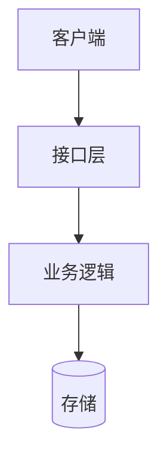
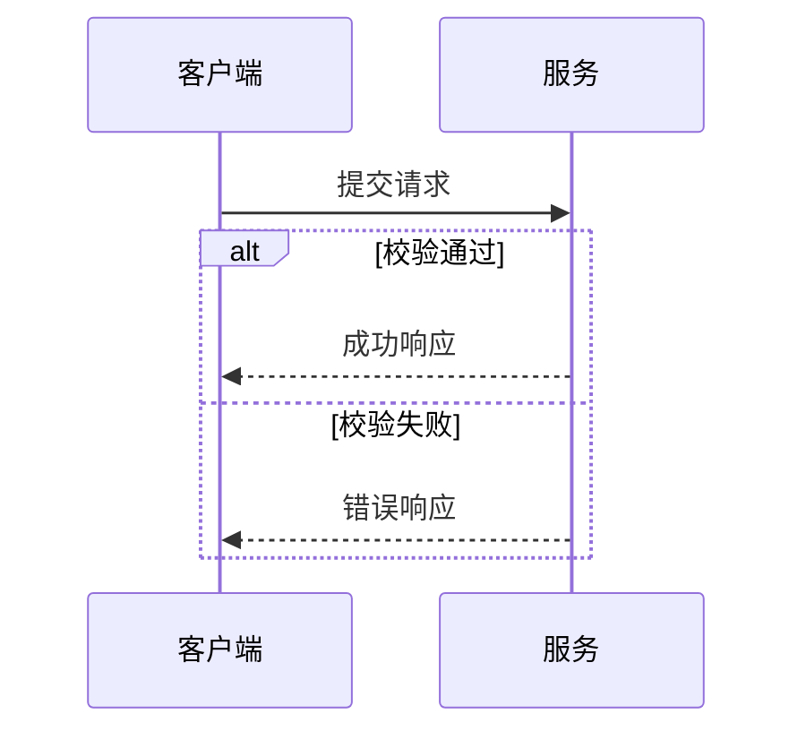

# 软件设计文档与 Mermaid

用于设计文档、Wiki、源码转图，以及 Mermaid 生成、修复与导出。单图请求不扩写成完整文档。

## 选择图类型

| 要表达的关系 | 图类型 | 重点 |
| --- | --- | --- |
| 模块依赖、架构、部署、业务分支 | flowchart | 用分组表示边界，标明边是调用、数据流还是依赖 |
| API 调用、跨服务协作 | sequenceDiagram | 按参与者和时间排序，区分请求、响应、异步和异常分支 |
| 对象结构、继承与组合 | classDiagram | 只展示与问题有关的成员和关系 |
| 数据实体及关系 | erDiagram | 核对主外键、基数和可选性 |
| 生命周期、事件迁移 | stateDiagram-v2 | 标明状态、触发事件、守卫条件及终态 |

简单结构优先通用语法。目标不支持 C4 或实验语法时，改用 flowchart，不让图类型限制交付。

按关系选择一个基础模式，替换节点和标签，不把示例系统当成用户事实。布局默认 `TD`，明显的横向数据流用 `LR`；时序按发起者、服务、存储排列。常用起点如下：

状态迁移用 `stateDiagram-v2`，实体关系用 `erDiagram`，类型依赖用 `classDiagram`。验证节点 ID、引号、块结束符、图类型和 ER 基数。

## 组织设计文档

以 [精简设计模板](../assets/design-document.md) 为章节基线，根据任务裁剪，不引入无关章节：

- 背景、目标与非目标。
- 现状、约束和关键假设。
- 方案、模块职责与相应图示。
- 接口或数据模型，以及错误、重试、一致性等实际相关行为。
- 方案取舍、验证方式、迁移与未决问题。

API 设计重点写契约和错误语义；数据库设计重点写关系与约束；功能设计重点写流程、状态与验收标准。缺少事实时明确待确认，不编造内容填满章节。

## 编写与验证

1. 节点 ID 使用简短稳定标识；中文和特殊字符放在带引号的标签中，如 `client["客户端"]`。用边标签说明关系，避免混用方向含义。
2. 用 subgraph 表示真正的系统或责任边界。降低交叉线和标签密度，过密时按问题拆图；颜色不是唯一编码。
3. 自定义样式时同时指定文字颜色并保持对比度。Unicode 图标仅在有助于识别且目标支持时使用。
4. 需要文件时保留 .mmd 源码。将 Mermaid 放入 HTML 的 `.mermaid` 节点并使用固定版本 Mermaid npm 包在浏览器渲染；根据控制台报错修正语法。
5. GitHub/GFM 交付 mermaid 代码块；不支持 Mermaid 的目标平台交付渲染后的 PNG/SVG，并保留源码。用户只要源码时不额外生成图片。
6. 图后简述关键关系、假设与边界。只有实际渲染通过才标为已验证。

## 浏览器渲染与截图

在 HTML 文档中将 Mermaid 源码放入 `.mermaid` 节点，通过固定版本的 Mermaid npm 包渲染；直接在浏览器打开页面，检查布局和控制台，再用浏览器截图功能保存 PNG。HTML 和 Mermaid 源码共同作为可编辑交付物，不需要 Python、Matplotlib、Shapely、mermaid-cli、本地服务或构建步骤。

失败时从控制台报错对应的行检查：节点 ID 是否引用一致或误用了 `end` 等保留词；标签中的特殊字符是否已引号或转义；`subgraph`、`alt`、`loop` 等块是否闭合；图类型是否被当前 Mermaid 版本支持。修复后重新打开页面；渲染成功前不要把截图链接合入正式文档。仍无解时说明浏览器版本或 CDN 限制，不把源码发送给外部服务。

## 扩展类型与来源分析

C4、`architecture-beta`、`block-beta` 以及 Gantt、pie、mindmap、timeline、quadrantChart、requirementDiagram、journey 只在目标渲染器支持时使用。架构类型不兼容时可改普通 `flowchart`，保留边界和关系标签；统计或时间图应选择语义等价的形式，不因兼容性静默删减信息。数值、日期和评分来自用户或证据。复杂地理、统计交互或实际时间比例探索使用 [数据可视化分支](visualize-data.md)，不勉强套 Mermaid。

## 从源码提取

从实际入口、调用位置、数据模型和配置生成节点与连线，保留源文件/符号定位，不把命名惯例当成已确认行为。区分静态依赖与运行调用、同步与异步、进程内与跨服务边界；动态调用无法静态确认时标注边界。架构图表达职责/依赖，时序图表达一次路径，活动图表达分支，部署图表达进程、网络和资源。

按需读取相关实现，不为了全面扫描无关模块。大系统先分层，超过约 16 个节点时拆视图并说明省略内容。API 文档关注请求/响应、鉴权、验证和错误语义；数据库关注键、基数、约束和迁移；功能关注状态、分支和验收；没有证据的指标列为待确认。文档使用 [统一模板](../assets/design-document.md)，保持术语和代码一致。

GitHub Wiki/WikiTicket 以 fenced Mermaid 为主；Confluence、Notion、Word、PDF 需要图片同时保留源码。本地文档保持正确的相对图片路径。

Mermaid 无法表达的 Salt 线框、用例、timing、ArchiMate、nwdiag、WBS 或已有 .puml 文件，用户明确要求时使用可用 PlantUML 工具并渲染 PNG/SVG。普通类图、ER、状态和组件图仍用 Mermaid；工具不可用时说明缺项，不虚构转换结果。
